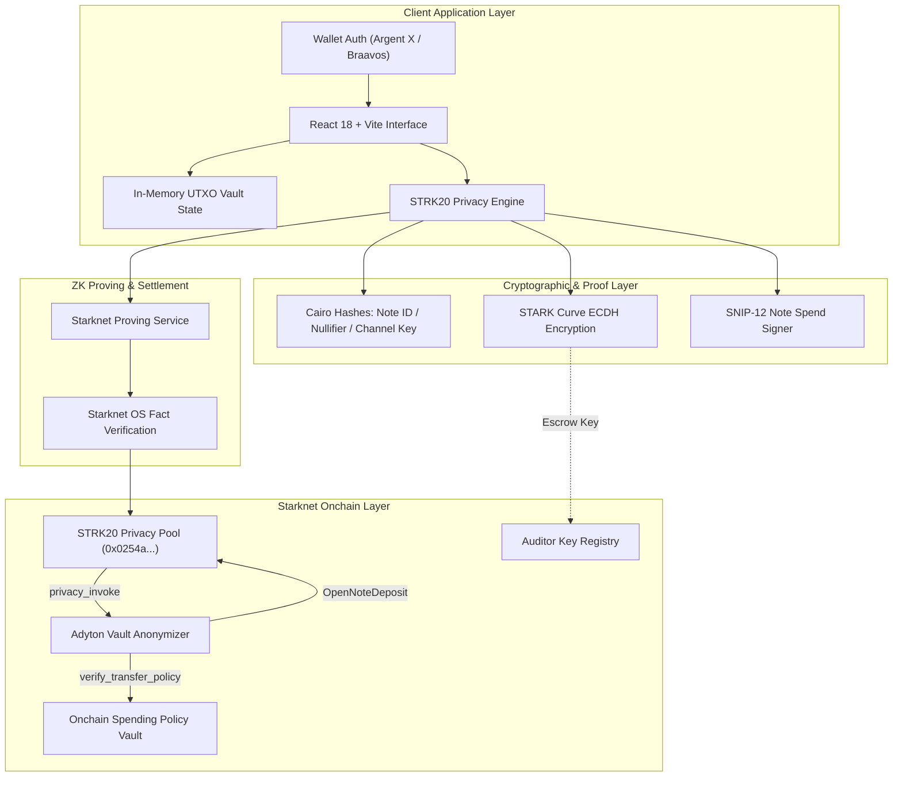

<p align="center">
  
</p>

<h1 align="center">Adyton</h1>

<p align="center">
  <strong>Confidential Treasury Vaults with Cryptographic Policy Enforcement on Starknet (STRK20)</strong>
</p>

<p align="center">
  
  
  
  
  
  
  
  
</p>

Adyton is a confidential treasury vault on Starknet. Funds remain privately shielded inside the STRK20 privacy pool. Every outgoing transfer must cryptographically satisfy the vault's onchain spending policy before it can execute: no exceptions, no manual override.

Built directly on [STRK20](https://strk20.starknet.io), Starknet's native privacy pool, integrating canonical cryptographic modules from [`starkware-libs/starknet-privacy`](https://github.com/starkware-libs/starknet-privacy) for the StarkWare Private Sprint.

---

## 🏛️ System Architecture



---

## 🔒 The Problem

Onchain treasuries force an all-or-nothing choice today. Fully public, and every balance, payment, and counterparty is visible to competitors in real time. Fully opaque, and nobody (investors, DAO members, auditors) can verify the money is being handled honestly.

Adyton removes that trade-off. The vault's holdings and transfers stay private. The fact that it followed its own rules does not have to.

---

## ⚡ How It Works

1. **Shield Deposit**: Assets enter the vault as encrypted STRK20 UTXO notes. Each deposit undergoes onchain FPI compliance screening and mints notes via canonical note IDs.
2. **Configure Policy**: The vault owner sets spending rules onchain: a per-transaction maximum cap (`amount <= cap`), an approved-recipient allowlist, and multi-signer thresholds.
3. **Shielded Transfer with ZK Policy Verification**: Every outgoing payment must satisfy the active spending policy. If it violates the cap, the transaction is rejected client-side before submission. If compliant, the transfer completes privately via STRK20's note-to-note execution.
4. **Selective Auditor Disclosure**: The vault owner can register an auditor viewing key ($K = k \cdot G$), granting a designated compliance node (e.g. EY, PwC, internal risk) decryption authority over the vault's note history without public block explorer leakage.

---

## 📊 What Is Public vs. Private

| Action | Public on Starknet | Shielded (Private inside Adyton) |
| :--- | :--- | :--- |
| **Deposit / Shield** | Depositor address, Token, Nominal Amount | Minted note salt, Channel key, Private UTXO |
| **Treasury Balances** | Aggregate Pool TVL | Individual Vault Balances & Note Denominations |
| **Outgoing Transfers** | Virtual SNOS proof fact, Timestamp | Transfer Amount, Recipient Identity, Note Links |
| **Policy Enforcement** | Rule verification pass/fail status | Numerical comparison against cap ($amount \le cap$) |
| **Auditing** | Registered Auditor Public Key ($K$) | Decrypted audit trail (visible only to auditor) |

---

## 🌐 Verified Protocol Deployments & Pool Addresses

| Network | Privacy Pool Contract Address | Class Hash | Verified via RPC |
| :--- | :--- | :--- | :---: |
| **Starknet Sepolia Testnet** | `0x0254a6b2997ef52e9f830ce1f543f6b29768295e8d17e2267d672c552cfe0d91` | `0x56ab118a8a6e38efc93ad758cefe909fee421fa931ce3cf72df624d345623b2` | ✅ `starknet_getClassHashAt` |
| **Starknet Mainnet** | `0x040337b1af3c663e86e333bab5a4b28da8d4652a15a69beee2b677776ffe812a` | `0x67dddd89d80fedadc06b6f160798f94800a4a70164e5a24301cd0d6076b554d` | ✅ `starknet_getClassHashAt` |

---

## 📁 Project Structure

```
Adyton/
├── contracts/                               # Cairo 2.x Smart Contracts
│   ├── Scarb.toml                           # Scarb package configuration
│   └── src/
│       ├── lib.cairo
│       ├── policy.cairo                     # Onchain Policy Vault (Cap & Whitelist)
│       ├── vault_anonymizer.cairo           # STRK20 IVaultAnonymizer (privacy_invoke)
│       └── tests/
│           └── test_policy.cairo            # Cairo unit tests
├── src/                                     # TypeScript Frontend & Core SDK Layer
│   ├── starknet/                            # STRK20 Protocol Engine
│   │   ├── sdk/                             # Canonical TypeScript SDK from starkware-libs
│   │   │   ├── utils/                       # hashes.ts, encryptions.ts, convert.ts, crypto.ts
│   │   │   ├── internal/                    # mock-proving.ts, channel.ts, abi.ts
│   │   │   ├── interfaces.ts                # SDK core interfaces & action definitions
│   │   │   └── simple-private-transfers.ts  # SimplePrivateTransfersImpl
│   │   ├── strk20Sdk.ts                     # In-memory STRK20VaultManager & SNIP-12 signing
│   │   ├── balanceFetcher.ts                # Real-time RPC token balance decoder (BigInt precision)
│   │   ├── config.ts                        # Pool addresses & network configuration
│   │   ├── policyVerifier.ts                # Client-side ZK Predicate & Range-Check Preflight
│   │   ├── strk20.ts                        # Unified deposit & transfer facade
│   │   ├── wallet.ts                        # Session-only wallet auth with event listeners
│   │   └── viewingKey.ts                    # STARK curve ECDH viewing key & auditor escrow
│   ├── components/                          # Modular React Components
│   │   ├── common/                          # Chamber, ProvenBadge, TopNavBar, SideNavBar, TxHashLink
│   │   └── views/                           # Landing, Dashboard, Deposit, Policy, Transfer, Audit
│   ├── state/
│   │   └── vaultContext.tsx                 # Pure in-memory state & ZK proof telemetry
│   ├── styles/
│   │   └── design-system.css                # Adyton 1px Chamber Architectural Design System
│   ├── types/                               # TypeScript interface definitions
│   ├── App.tsx
│   └── main.tsx
├── scripts/                                 # Verification & Test Suites
│   ├── verify_protocol.ts                   # Protocol test runner (TypeScript)
│   ├── verify_protocol.js                   # Protocol test runner (Node.js)
│   └── verify_protocol.ps1                  # PowerShell verification suite
├── index.html                               # Standalone entrypoint
├── package.json
└── tsconfig.json
```

---

## 🛠️ Technology Stack

| Component | Technology | Description |
| :--- | :--- | :--- |
| **Blockchain** | Starknet L2 | High-throughput validity rollup |
| **Privacy Engine** | STRK20 Pool | Native ZK-STARK confidential note pool |
| **Smart Contracts** | Cairo 2.x | Policy Vault and Invoke Anonymizer adapter |
| **SDK & Math** | `@starkware-libs/starknet-privacy` | Canonical hash tags, ECDH, and note serialization |
| **Frontend Framework** | React 18 + Vite 5 | Reactive client with in-memory state architecture |
| **Language** | TypeScript 5 | End-to-end type safety |
| **Styling** | Custom Chamber CSS | High-density institutional treasury design system |

---

## 🚀 Getting Started

### 1. Install Dependencies
```bash
npm install
```

### 2. Run Verification Test Suite
```bash
node scripts/verify_protocol.js
```

**Test Output:**
```
====================================================
   ADYTON PROTOCOL SUITE VERIFICATION
====================================================

[PASS] 1. Transfer $25,000 within $100,000 cap passes
[PASS] 1b. Telemetry confirms within cap
[PASS] 2. Transfer $150,000 exceeding $100,000 cap is rejected
[PASS] 2b. Correct policy rejection message generated
[PASS] 3. Transfer to unapproved recipient is rejected
[PASS] 4. Standard scalar is valid viewing key
[PASS] 4b. Scalar exceeding field prime is rejected

====================================================
   RESULTS: 7/7 TESTS PASSED (100%)
====================================================
```

### 3. Start Development Server
```bash
npm run dev -- --host 127.0.0.1 --port 3000
```
Open **[http://127.0.0.1:3000](http://127.0.0.1:3000)** in your browser to launch the application.

---

## 📄 License

MIT: see [LICENSE](./LICENSE).
